# About this User Manual

Maintainer: Carlos Pascual-Izarra < cpascual [AT] users.sourceforge.net >
This manual is work in progress.
The most recent version of this manual can be found at:
[http://pascual.sourceforge.net/UserManual.html](http://pascual.sourceforge.net/UserManual.html)
It describes the features of the latest version (sometimes describes features that are only present in the development version but which will be available soon in the stable version)
The screenshots shown in the manual may differ sometimes from the latest version. They are only updated if it affects to the discussion.

# Introduction

PAScual is a program for analysing PALS spectra.
The analysis is done by fitting the spectra to a model.
PAScual is in some ways similar programs like LTv9 or PALSfit, but it has some features that make it unique:

*   It is free / open source software (GPL license). So you can see the code and adapt it to your needs.
*   It gives options for choosing the fitting method: other programs use only Levemberg-Marquardt algorithms for the fit. PAScual offers a global minimisation algorithm (Simulated annealing) as well.
*   It offers a powerful tool for characterising the uncertainties in the results: The Markov Chain Monte-Carlo Bayesian Inference algorithm.
*   It allows you to set limits to the fitting parameters
*   It has an intuitive and easy Graphical User Interface, but it can also be used in text mode or incorporated as a library into your own program.
*   It is written in [Python](http://www.python.org/), so it is multi-platform (runs on Linux, Windows and Mac systems)
*   ...and many more as it will be shown in the rest of the manual

### ...but, what is PALS?

PALS stands for Positron Annihilation Lifetime Spectroscopy. If this still doesn't ring a bell, you probably don't need PAScual at all!
Still, if you are curious, you can check these [links](links.html) where you can find some information about PALS.

# Installation

The easiest part of the installation is to install PAScual itself. Simply download the zip file from [http://pascual.sourceforge.net](http://pascual.sourceforge.net/) and unzip it in any directory you want.
**But** you must have a few things installed **first**. If you are a Python user, some of them may already be installed in your computer. If not, you will need to install them. These "prerequisites" are listed in the next subsection.
You can check whether the required packages are installed or not by using the small script called <tt>testinst.py</tt> provided in the PAScual package. Note that if you don't have Python installed at all, the script won't run (that is the first check!).

## Prerequisites

Here is a list of packages that you need installed to use PAScual. All of them are free software that can be freely downloaded.
General Installation instructions:
For running PAScual you need, at the very least:

*   [Python](http://www.python.org) >=2.5
*   [Numpy](http://numpy.scipy.org/) >=1.0.3
*   [scipy](http://www.scipy.org/SciPy) >=0.5.2

For using the GUI interface (which I bet you want), you need also:

*   [Qt](http://trolltech.com/products/qt/) >=4.2.3
*   [PyQt](http://www.riverbankcomputing.co.uk/software/pyqt/intro) >= 4.2.3
*   [pyQwt](http://pyqwt.sourceforge.net/) >=5.0.1

For getting graphical output in the text mode interface, you need:

*   [matplotlib](http://matplotlib.sourceforge.net/) >= 0.90.1

If you work on text mode a lot, Using [IPython](http://ipython.scipy.org/moin/FrontPage) can be very convenient.

## Specific installation instructions for the different operative Systems:

### For Windows:

This is a step-by-step guide that will allow most Windows users to install the required packages for PAScual. It assumes a Windows XP (32 bit) machine. If your computer is different or you have different requirements, you may prefer to install a different set of packages (or even compile them yourself from sources). If so, refer to the requisites in the General Installation Instructions.
Install the following in the given order:

1.  [python-2.5.2.msi](http://www.python.org/ftp/python/2.5.2/python-2.5.2.msi)
2.  [numpy-1.1.0-win32-superpack-python2.5.exe](http://prdownloads.sourceforge.net/numpy/numpy-1.1.0-win32-superpack-python2.5.exe)
3.  [scipy-0.6.0.win32-py2.5.exe](http://prdownloads.sourceforge.net/scipy/scipy-0.6.0.win32-py2.5.exe?download)
4.  [PyQt-Py2.5-gpl-4.4.2-1.exe>](http://pyqwt.sourceforge.net/support/PyQt-Py2.5-gpl-4.4.2-1.exe) (note that this already includes the Qt package)
5.  [PyQwt5.1.0-Python2.5-PyQt4.4.2-NumPy1.1.0-1.exe](http://prdownloads.sourceforge.net/pyqwt/PyQwt5.1.0-Python2.5-PyQt4.4.2-NumPy1.1.0-1.exe)

If you intend to work in text mode, I recommend you the following too:

*   [matplotlib-0.91.2.win32-py2.5.exe](http://downloads.sourceforge.net/matplotlib/matplotlib-0.91.2.win32-py2.5.exe?modtime=1199628765&big_mirror=0) (Needed only for graphs support in the text interface)

The above packages can be installed using the default options (i.e. "next", "next", "next"...).
Make sure that no errors are reported during installation. Typical symptoms for trouble are warnings about Python25 not been found in your system!
If you don't have administrator rights on the computer, you may still be able to install the required programs, but it will be a lot more tricky. So, if you can, use an administrator user account for installing the required packages, and install them for all users. Then, the PAScual Package can be unzipped and run by any user (no need of special permissions).

### For Linux:

Check the requirements in the [prerequisites](User%20Manual.html#prerequisites) section. Each of these packages should be available in any recent GNU/Linux distribution.

### For Mac:

As far as I know, every required package is available for Mac (follow the links in the [prerequisites](User%20Manual.html#prerequisites) section). I haven't tested them myself. If you own a Mac and you install PAScual, please report it so that I can fill this section.

# Starting PAScual

## The quick answer:

Execute PAScualGUI.py

## The longer answer:

The PAScual package consists in a directory containing many files and some subdirectories. As a user of PAScual, you will only be interested in a few of the files.

PAScual is written in the [Python](http://www.python.org) programming language. This means it does not need to be compiled (you can make changes to the code and run it straight away). For this reason, the files you will be executing are indeed the source code of the program. Feel free to have a look.

In order for your computer to understand the Python language, you must have the _Python Interpreter_ installed (that is the first of the required packages mentioned in the installation). PAScual also makes use of other third-party libraries, which accounts for the rest of required packages.

Most people will be interested in starting the Graphical User Interface (GUI). To do so:

1.  make sure that you have all the required packages installed. See the installation instructions about how to check this.
2.  go to the directory were you installed (unzipped) PAScual
3.  execute the file called <tt>PAScualGUI.py</tt> (windows users would double-click on the file , GNU/Linux console users would type <tt>python PAScualGUI.py</tt>)

The former instructions should bring the main window of PAScualGUI.

## Troubleshooting

If something goes wrong, first check step 1!
A good way of troubleshooting, is opening <tt>PAScualGUI.py</tt> with [IDLE](http://www.python.org/idle/doc/idlemain.html), which is already included in your Python distribution (windows users: right-click on the file and select "EDIT with IDLE"). Then, from the "Run" menu, you select "Run Module". In this way, any error messages will be written in the "Python Shell" window.

# The Graphical User Interface

The GUI consists in a main window with various tabs for accessing different options.
In the following subsections, a quick description is given. Note that the screenshots might not correspond to the latest version available.

## Quick-and-dirty guide

[Here](Quick-and-dirty%20guide.html) are some use instructions I copied from an email to a person asking for support. Not too neat, but they may be useful.

## Getting help

PAScual offers help to the user in 3 main ways. Sorted by the level of detail are: tooltips, the "What is this?" tool and the User Manual.

### Tooltips

This are the small tips that appear if you leave the mouse over certain elements of the graphical interface. They give a very short description about the elements purpose.

### "What is this?" tool

It can be accessed via the Help menu or via the () button. It will allow you to point to certain elements of the graphical interface and get a somewhat detailed description of its function.

### User Manual

The main source for help is the [User Manual](User%20Manual.html). You can access it from the Help menu. But be aware that the manual version packed with each copy of the program may not be up-to-date. It is strongly recommended to access the online version at [http://pascual.wiki.sourceforge.net/User_Manual](User%20Manual.html).

## Loading a spectrum

You can load one or more spectra using Load Spectra option from the File menu.

PAScual can read various formats of spectra:

*   ASCII containing channel counts only
*   ASCII with user defined header
*   LTv9 format
*   L80 format
*   MAESTRO binary files
*   PAScual (".ps1") format

The default format, <tt>ASCII</tt> expects no header. The file should contain spectrum yields separated by any type of blank space.
If you have files with a number of lines of header, use the <tt>ASCII-custom</tt> format and, when prompted, specify the number of lines that should be ignored.
If you use LT style files (ASCII with a 4-row header), you can use the <tt>LT</tt> option.
The <tt>L80</tt> format is an ancient format in which the spectrum yields are given in multicolumn format.
The <tt>MAESTRO</tt> format will read binary files created by Ortec's MCA software.
The <tt>PAScual</tt> format stores not only the spectrum but also every other parameter for this spectrum. Therefore, when loading a spectrum in ".ps1" format, you automatically recover any parameters that you previously set.

Whatever format you choose, PAScual will remember it and will default to it in the future.

Note: if you use a format that is not currently supported, you can:

*   Add the format to PAScual yourself (very easy if you can program in Python): have a look at the <tt>SpecFiles.py module</tt> and to <tt>specFileLoaderDict</tt> in <tt>PAScualGUI.py</tt>.
*   Request support for your format (contact the author sending a sample file and all the information you have about the format).

Note, after loading one or more files, the [Parameter Wizard](User%20Manual.html#paramwizard) is automatically invoked.

## Saving a spectrum

Once a spectrum is loaded, it can be saved in different formats (so PAScual can be used as a format conveter). The supported file formats are:

*   ASCII (no header, 1 column)
*   LT: if the FWHM and the channel width have been set, the spectrum can be saved in a format that LTv9 will understand.
*   PAScual (or "<tt>.ps1</tt>") format: This format saves, in a single file, not only the spectrum but also all the parameters associated with it. Note , however, that the spectrum in ".ps1" format can only be read with PAScual.

The spectra saved in ".ps1" format can be used also as templates for setting parameters in other spectra.

## Spectra selection

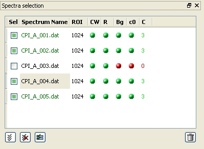
_The spectra selection list panel_

When loading a spectrum, its name is added to the list in the spectra selection pane. By default, this list is located on the top left of the PAScual window, but it can be moved or hidden by the user.
The list contains various columns. From left to right, these are:

*   The left-most one ("Sel") contains a check box for each spectrum. When assigning the initial values of the parameters (see the [Parameters tab section](User%20Manual.html#paramtab)), **the user actions will only affect to the spectra that are checked in this list**. See the "Checking/unchecking spectra" section below for more details.
*   The spectrum name. When just loaded, the name is black. When the spectrum is ready to be fit (all the parameters have been set), the name turns green.
*   The ROI column indicates the number of channels selected for the Region-Of-Interest for each spectrum.
*   The "CW", "R", "Bg" and "c0" columns (which stand for "channel width", "resolution", "background" and "channel-0", respectively) show a red or green bullet depending on whether the corresponding parameter has been set for the spectrum or not.
*   The last column, "C", indicates the number of components that have been set for this spectrum.

Note that a spectrum is only ready to be fitted when the ROI, CW, R, Bg, C0 and C columns are all green. On the other hand, whether the spectrum is checked or not (the "Sel" column), does not have an effect in terms of it being fitted or not.

### Checking/unchecking spectra

Each spectrum can be checked or unchecked in a number of ways:

1.  When one or more spectra are loaded, they get checked by default (and any previously loaded spectra get unchecked).
2.  Each spectrum can be checked/unchecked individually by clicking on its checkbox
3.  Double-clicking on a spectrum name will check this spectrum and uncheck all the rest
4.  At the bottom-left of the list there are 3 buttons that affect the spectra that are checked. From left to right, they do the following:
    1.  Check all the spectra in the list
    2.  Uncheck all the spectra in the list
    3.  Check only highlighted spectra (use the mouse to highlight selections of spectra first)
5.  On the bottom right, the "trash bin" button can be used to remove the **checked** spectra from the list.

## Plot panel

By default, a plot panel is shown on the bottom left corner of the main window. It shows all the spectra **that are checked** in the selection list.
This panel can be detached and moved around. It can also be hidden (either using the close button on the panel or by using the show/hide plot in the View menu).

_The Plot panel_

### Showing/hiding particular plots

By default, the Plot panel shows the spectra that are checked in the spectra selector. By clicking on the legend names, one can show and hide particular spectra without affecting to the spectra selection.

### Zooming

Zooming in: it is possible to zoom in by selecting a region of the plot with the mouse.
Restore original view: undo all zooming-in, simply click the plot with the secondary button of the mouse (usually right-click)
Undoing single zooms: You can undo the last zooming-in step by using the tertiary button of the mouse (normally middle button)

### Tips

*   The options for showing hiding particular plots and for zooming can also be used in other plot windows of the program such as the ROI selector, the auto-background calculator or the residuals plot.
*   If very large numbers of spectra are loaded, PAScual may need long times to plot them all in the panel. You can speed things up by closing the plot pane (which is not terribly useful when cluttered with 100+ spectra, anyway).

## The Parameters tab

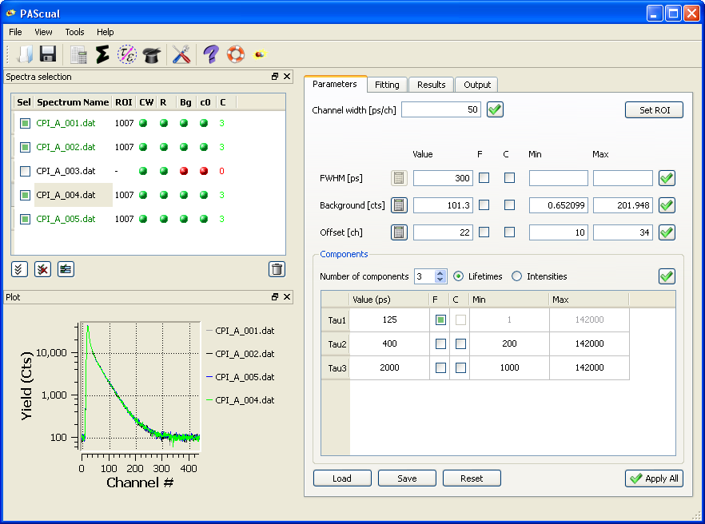

This is the tab that is first seen. It allows the user to set the parameters needed to start the fit of each spectra.

### Assigning parameters

Next to each parameter there is an "Apply" button :  This will assign the parameter value (and other options like min/max, fix,...) to the checked spectra (i.e., to those spectra in the spectra selection table showing a green square next to the name). In the above screenshot, clicking on any of the "Apply" buttons, would affect to all spectra except <tt>CPI_A_003.dat</tt>
**Important:** The parameters are assigned **only** to the spectra that are checked.

The "Apply All" button in the bottom-right corner is equivalent to pressing all the "Apply" buttons at once.

For each parameter that can be fitted, some more options can be set:

*   Fix: The check box labelled "F" allows to "Fix the parameter (that is, to give it a fixed value and exclude it from the parameters that need fitting)
*   Common: The check box labelled "C" indicates that, _when applied_, this parameter is to be common for all the spectra that are currently checked. This means that the spectra will be linked in a single set for fitting purposes. A common parameter is fitted, but its value is the same for the set group of spectra sharing it. This is similar to (but a bit more flexible that) the "global" parameter option in a "series fit" in LTv9.
*   Minimum/Maximum: the box labelled "Min" allows the user to set a minimum allowed value to the parameter. Similarly for "Max".

### Load, save and reset parameters

Three buttons at the bottom-left of the parameters tab can be used for managing the parameters. The "save" button allows the user to store the currently shown values of the parameters in a <tt>*.par</tt> file. This file can be later loaded using the "load" button. In this way, regularly used parameter configurations can be stored so that it can be retrieved. The reset button simply clears all the fields in the tab.

**Tip:** since spectrum files in PAScual (<tt>*.ps1</tt>) format can also store parameter settings, the load button will also show them for loading. In this way, a previously saved spectrum can be also used as a template for setting parameters of new spectra.

**Important:** take into account that loading or resetting the parameter configuration does not automatically assign the new parameters to the activated (checked) spectra. Instead, it just fills (or clears) the values in the parameters tab. You can then use the individual "apply" buttons (or "apply all" button) to set the parameters to the checked spectra. Similarly, the "save" button in the parameters tab does not save the current spectra at all, but only the parameters configuration shown in the parameters tab.

### Automatic guess of parameters

Some parameters can be automatically estimated by PAScual. These have a "calculator" button () next to them. When pressing the button, the values will be calculated for each checked spectrum independently, and automatically assigned to them. This means that, for example, if the automatic calculation is used for the background of various selected spectra, each one will be assigned a potentially different estimation. Note that this is different to pressing the "Apply" button with many spectra checked (in which case, the same value is assigned to all the checked spectra.

At this moment, two parameters can be automatically guessed: the background and the offset. The background is estimated from a user-selected region of the spectrum (see the ROI selection subsection below). The offset is estimated as the channel where the maximum of the spectrum is (note that this is generally one or two channels wrong, but it is generally good enough as an initial guess).

Note that automatic parameter guessing is taken a further step forward if you use the [Parameters Wizard](User%20Manual.html#paramwizard).

### Region Of Interest (ROI) selection

By clicking on the "Set ROI" button on the parameters tab, the ROI selection window appears. The user can select the region of the spectrum that will be fitted. A lower limit and upper limit can be set. and each of them can be given as "absolute" or "relative to the maximum" channels. The "relative to the max" option is useful to set similar fitting conditions regardless of large variations in the offset.

The values can be entered by typing them directly in the corresponding boxes or by _first_ clicking in the box _and then_ clicking in a selected point of the plotted spectra above.
When clicking on the OK button, the selections will be applied to the spectra that are checked in the Spectra Selection table (actually, those shown at the right of the plot).
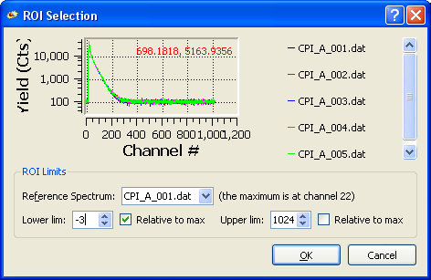
_The Region-Of-Interest (ROI) selection window._

Note: when using the option for automatic guess of background, a very similar window pops out. The same options apply.

## The Parameters Wizard

Since version 1.2, PAScual offers an even easier and quicker way of setting the parameters for the spectra: the Parameters Wizard.
This is an assistant that helps in setting the values for the parameters in the Parameters tab. The Wizard will try to offer reasonable values and guide you so that the spectra get ready for fitting. In the last step of the Wizard, you can check a summary of the proposed settings and either accept (finish) or reject them (cancel). If accepted, the settings are automatically applied.

See some screen captures and details on how t use the Parameters Wizard in the [Example 1](User%20Manual.html#example1).

Note that the Wizard aims to provide settings useful in most common situations. If you need more control than what the wizard offers (e.g. fixing parameters or declare them common,...), you can always use the wizard and then _modify_ any setting that you want to fine-tune (or just cancel the wizard and set everything using the parameters tab directly).

## The Fitting tab

This tab offers options on the fits to be performed. We call this <tt>Fit Modes</tt>. A fit mode consists in one or more commands to be executed (more on commands below).

### Sets

A set is defined as one or more spectra sharing common parameters (therefore needing a simultaneous fit). The spectra are automatically distributed in sets according to user settings in the Parameters tab. If no common parameters were used, each spectra will form its own set. If some spectra share common parameters, they will be automatically grouped in a set.

On the right side of the Fitting tab, a tree-like view shows the sets that are constructed from the spectra. The contents of each set can be seen by expanding the tree branches.
If a spectrum is not ready to be fitted (i.e., if some of its parameters are not set), it will not be assigned to any set, and will contribute to the <tt>Unasigned</tt> count shown below the Sets tree.

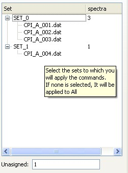
_The sets tree showing 2 sets: SET0 contains 3 spectra and SET1contains just a single spectrum. Another spectrum has not been assigned and is shown below._

### Fit modes

A fit mode is a sequence of commands to be applied to a set. The fit mode is selected in the drop-down list located at the top of the Fitting tab. The corresponding commands can be seen (and edited) in the list just below.
Some useful fit modes are already included (enough for most users). The user can edit/modify any of them. In future versions it will be possible to save user-edited modes for later use (using the save button next to the drop-down list).

The commands forming each Fit Mode can be:

*   LOCAL: performs a LOCAL fit. This is the fastest type of fit. It is very similar to what programs like LT of POSITRONFIT do. Use it if you are quite certain about your initial guesses.
*   SA: performs a Simulated Annealing fit. This is slower than LOCAL, but is (almost) insensitive to initial guesses.
*   BI: runs a Markov Chain Monte-Carlo Bayesian Inference (MCMC-BI) calculation. It is very slow but provides robust estimations on the statistical errors associated with the fitting parameters (and can, as well, provide other detailed information about the solution space).
*   SAVE: saves the current state of the fit (all the parameters). This can be loaded later for fitting the same spectrum or for fitting a similar one.
*   LOAD: loads a previously saved state of a fit. Does nothing if there is nothing previously saved.
*   END: finishes the fit (it can be omitted).

So, for example, the default Fit Mode, called <tt>LOCAL-connected</tt> is formed by the following sequence of commands: <tt>LOAD, LOCAL, SAVE</tt>

This means that, for each set, it will load the previous results (if any), then it performs a local fit and finally saves the results for the next fit. In this way, the result of the previous fit is used to initialise the next fit (just as LTv9 does when fitting a series of spectra).

But, if one does not want to initialise the next fit with the previous one, <tt>LOCAL</tt> could be used instead (it just runs <tt>LOCAL</tt>, without loading or saving.

Note that different algorithms can be run in sequence: for example, the Fit mode called <tt>SA+LOCAL+BI</tt> does exactly that: it runs a Simulated Annealing fit, followed by a Local fit to refine the solution (the LOCAL is initialised at the solution found by SA) and finally, followed by a MCMC-BI calculation.

### Fit execution controls

At the bottom of the fitting tab there are 3 buttons for launching the fit and controlling its execution.
When the "Play" button is clicked, the fit is launched for the sets listed in the Set tree. Each set is placed in a queue and is fitted when the previous one is finished. The fit consists in applying the fit mode that was assigned to it.
The "Stop" button will abort all the fits. Note that, sometimes, it may take some time for a fit to actually respond to the stop request.
The "Skip" button attempts just the fit for the set currently being fitted. Then it jumps to the fit of the next set in the queue.

The progress bars next to the buttons indicate the progress of the fit. Note that the total fit is subdivided in fits for each set which are in turn subdivided in commands. The progress bars reflect this and inform of the progress in each of this aspects.

## The Results tab

This tabs shows the results for each spectrum in a compact table.

### The results table

All the relevant parameters for each spectrum are summarised In a table. Each row corresponds to a fitted spectrum.
It is possible to select portions of the table and copy them to a spreadsheet program (use right-click to obtain the context menu and choose the <tt>copy selection</tt> option).
**Note**: the CTRL+C key combination only copies one cell. You need to use the context menu option for copying a whole selection, as explained before.
The columns of the table can be hidden (or revealed) by selecting them on the list at the left of the results table and using the Hide/Show buttons.

### The individual spectrum fit report (Components and residuals)

Since version 1.3 a much improved result visualisation tool has been implemented, called the "Fit Results report" tool.
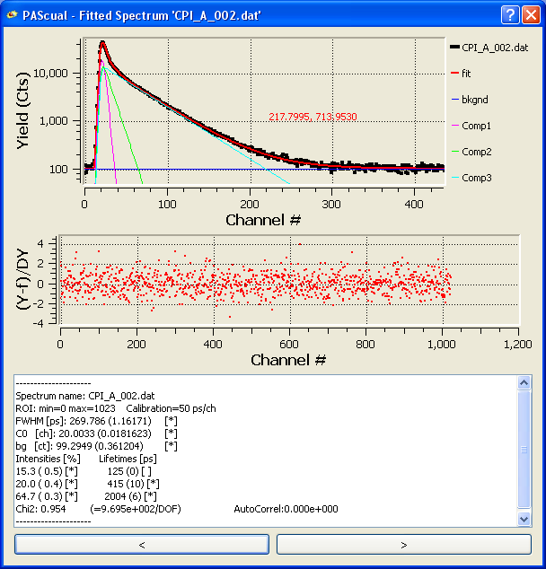

The fit results report tool can be accessed by any of the following methods:

*   using the () button at the top-right of the results tab
*   double-clicking on a given row of the results table
*   using the context menu option that appears when right-clicking on the results menu.

The fit results report window provides the following information:

*   The experimental and fitted spectrum. The fit shows also the various individual components and background.
*   The residuals plot (i.e., the difference between the fit and the experiment, normalised by the counting error at each channel).
*   A text report of the fit for this fit (similar to the log in the output tab)

At the bottom of the window, two buttons (marked with '<' and '>') can be used to scan through the various spectra already fitted.

Tip: just like with all other plots, the plots in this window can be zoomed in and out. See [the plot panel section](User%20Manual.html#plotpanel) for instructions.

## The Output tab

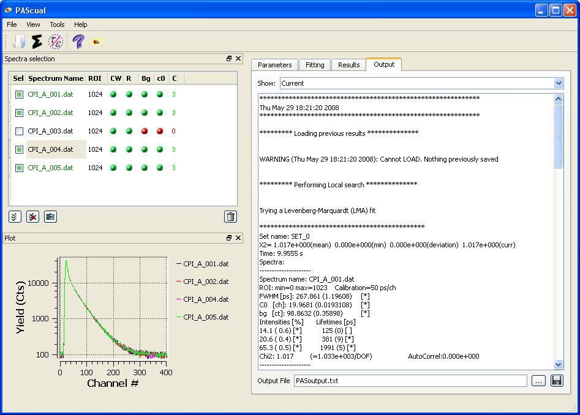

In this tab the detailed outputs from the fits are shown. You can choose to show the current fit or any previous fits you did in this session. The output is identical to the one that would be shown if using PAScual in text mode and it is more informative than the summary of results shown in the Results tab (and therefore is good to look at if you are getting unexpected results).

## Tao Eldrup Calculator

### Background information

Starting from version 1.1, a graphic interface to the Tao-Eldrup calculator program is included with PAScual.

The Tao-Eldrup calculator allows the user to calculate pore sizes from the ortho-positronium lifetimes, by making use of the Tao-Eldrup (TE) model. For information on the model, see:

1.  S.J. Tao, “Positronium Annihilation in Molecular Substances,” _The Journal of Chemical Physics_, vol. 56, Jun. 1972, pp. 5499-5510.
2.  M. Eldrup, D. Lightbody, and J.N. Sherwood, “The temperature dependence of positron lifetimes in solid pivalic acid,” _Chemical Physics_, vol. 63, Dec. 1981, pp. 51-58.

The Tao-Eldrup calculator can also use the [rectangular Tao-Eldrup model](http://positrons.physics.lsa.umich.edu/nanopos/PALS-intro/RTEmodel.htm) (RTE), which extends the validity range of the original Tao-Eldrup model to larger pores and takes into account the effect of the temperature. To know more about the RTE, see:

1.  T. Dull et al., “Determination of Pore Size in Mesoporous Thin Films from the Annihilation Lifetime of Positronium,” _Journal of Physical Chemistry B_, vol. 105, May. 2001, pp. 4657-4662.

Both the TE and RTE models allow one to calculate the lifetime corresponding to a given pore size. But the formulas involved are transcendental (i.e. they cannot be analytically inverted to obtain the pore size from a given lifetime). Since the parameter measured by PALS is the lifetime, this inversion is necessary. The Tao-Eldrup calculator works by numerically inverting the formula. For this it uses the [Newton-Raphson method](http://en.wikipedia.org/wiki/Newton%27s_method).

### The Tao-Eldrup calculator interface

The Graphical User Interface for the Tao-Eldrup calculator can be accessed from the Tools menu of PAScual, or directly using the  button. The calculator is a window separated in two main areas: the upper part is for input and the bottom part for showing the results of the calculation.
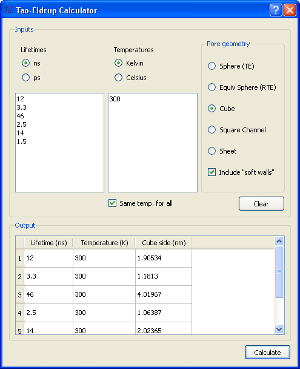
_The graphical user interface of the Tao-Eldrup calculator_

The calculator offers several options for the pore shape:

*   **Sphere**. The pore is spherical and the original TE model is used. This is the most standard calculation, but it is limited to small pore sizes only (see the references in the background section).
*   **Equivalent sphere**. This uses the RTE to calculate the size of a cubic pore corresponding to the given lifetime and then, it calculates the radius of an sphere that yields the same mean free path for ortho-positronium (the mean free path is the most relevant quantity, as discussed by Dull _et al_.). It is, therefore, just a way of comparing.
*   **Cubic**. It considers cubic pore geometry (using the RTE model). The result correspond to the side length of the cube.
*   **Square channel**. It considers an infinitely long channel-like pore of square section (using the RTE model). The result corresponds to the section side's length.
*   **Sheet**. It considers a geometry where 'pores' are spaces limited by flat planes (e.g., an ideal lamellar geometry). The parameter returned by the calculation is the distance between the boundary planes.

Apart from the shape, it is possible to select whether to include the "soft walls width" into the pore size or not. We call "soft wall width" to a distance parameter present in the models that defines a region of finite potential (as opposed to the "hard walls" formed by infinite potential). See the references in the background section above.

## Simulating a spectrum

Easy: just fill the parameters tab with the values you want in your simulated spectrum and then use the <tt>Simulate Spectrum</tt> option in the Tools menu. You will be prompted for the total number of counts in the spectrum and for a file location to save it.

## Summing spectra

From the main window you can sum spectra. Simply load the spectra you want to sum and check them (and only them) in the spectra selection panel. Use the "Sum spectra" option in the tools menu. You will be prompted for a file name for the new spectrum. The spectrum formed by the sum will be automatically loaded.

## Source correction

In the current versions, source components are supported simply as any other component.

For example, if you are using a Mylar-wrapped 22Na source that contributes, say, 5% to the spectrum at 1700ps, you can simply add another component with fixed lifetime (1700ps) and intensity (5%) when setting the components for the fit. Don't forget to check the "fix" option for **both** the lifetime and the intensity (unless you want them to be fitted).

As a side-effect of considering the source correction just as another component, they are counted towards the total intensity (e.g., in our example, the other components would sum up to 95% instead of 100%). This is just a matter of definition. If you really want to separate the components, it is as easy as multiplying the intensity results for the non-source components by _100/(100-s)_, where _s_ is the % of the source components (5% in our example).

## Advanced Options

Some settings for the program and for the fitting algorithms can be changed by selecting <tt>options</tt> from the <tt>tools</tt> menu (or by using the () button from the toolbar)
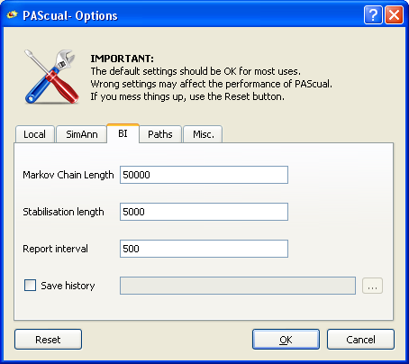

The options window gives access to some settings that may affect the performance of PAScual. On the other hand, for most typical uses of the PAScual program, the default values are fine. Do not change them unless you know what you are doing and, if you do, remember that you can always reset the defaults using the reset button.
Each option is explained in the contextual help that appears if leaving the mouse cursor over it.

# Examples

Here I am going to give a step-by-step example of few common things you can do with PAScual. I will be using the data provided in the examples directory of PAScual.

## Example 1: simple fit

1.- Launch PAScualGUI
2.- Click on <tt>File-->Load Spectra</tt> (or use the icon in the toolbar). This will open the "Open Files" window.
3.- Navigate to the <tt>examples</tt> directory.
4.- Choose "Files of Type: <tt>LT</tt>" on the bottom (the spectra we are going to load are in LT file format).
5.- Select the 5 files called CPI_A_00X.dat , (where X is 1-5) and click on "Open". Tip: you can select multiple files holding the CTRL key down while selecting them.
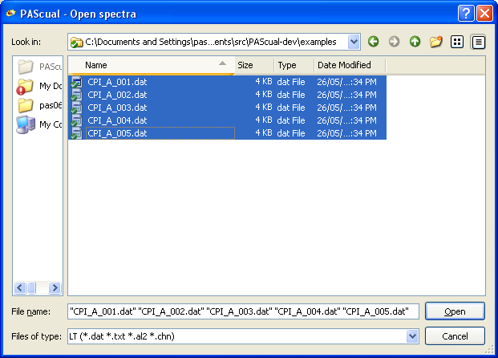
6.- When you selected open, the files were loaded, automatically inserted in the Spectra Selection list and checked. Also , the "Parameters Wizard" was launched.
7.- If we wanted, we could cancel the the wizard and set the parameters manually, but the Wizard will make it easier, so we use it.
8.- The first screen in the wizard allows us to set the Channel width (in ps per channel) and the instrumental resolution Full width half maximum (FWHM, in ps). These values depend on the experimental set-up. The channel width should be very well known through the calibration of the system and it is important to put the right number since it won't be fitted. The resolution FWHM is approximately known from the calibration and will be fitted, so an approximated guess will suffice. For this example, we set 50 ps/ch and 300 ps respectively. And we click on "Next".
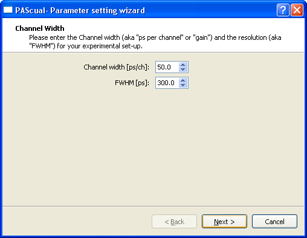
9.- The next screen in the wizard lets us set the Region of interest. The interface is exactly the same described in the [ROI selection section](User%20Manual.html#roisel) (read it for tips on how to perform graphical selection of parameters and how to zoom/unzoom in the plot). It is generally a good idea to select a region that starts from only a few channels below the maximum and ends as far to the right of the spectrum as there is significant data (i.e. just before any cut-off that could introduce a distortion, if any). For this example, we select 4 channels below the maximum (lower limit=-4 with the "relative to the max" option activated) up to the channel 1000 (upper limit=1000, not relative). Then we click "Next".
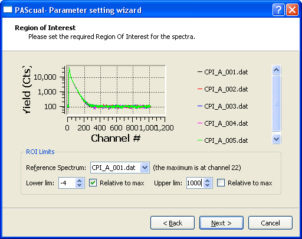
10.- The next page allows us to add components. It is possible to add some standard ones or custom ones. We add 3 components by clicking in "add ppS", then in "add Direct" and finally in "add oPs". In the text box on the right, we can see our selections and we can even edit them by hand.
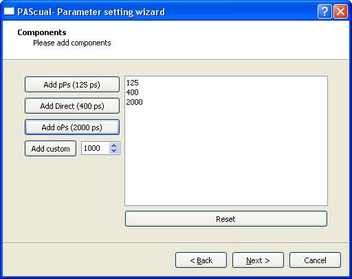
11.- Once added the 3 components, we click on Next and get to the Summary, where we can review the settings. It is important to take into account that it is always possible to refine some settings afterwards when we exit the Wizard. We click on "Finish" and can see that the spectra have been set with our selections. Click on any spectrum in the Spectra selection panel to see its specific settings (they are not necessarily the same for all spectra).
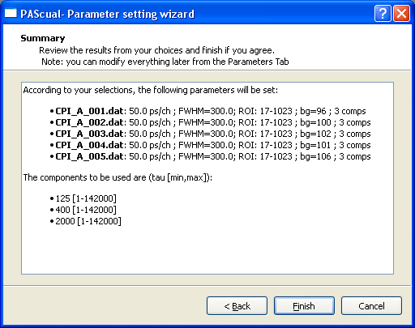
12.- We can observe that the checklist in the spectra selection panel is all green for our five spectra. This indicates that we can proceed to the fitting tab.
13.- Clicking on the Fitting Tab will show that 5 sets have been created, each one containing just one spectrum. The spectra of this example are all very similar, so it makes sense to use the results of each fit to initialise the next fit. Also, we want just a quick LOCAL fit. Therefore, we leave the fitting mode as <tt>LOCAL-Connected</tt> (see the explanation of the [fitting modes](User%20Manual.html#fitmodes) above).
14.- We only need to click on the "Play" button () to launch the fit. The fit should finish very quicikly in any modern computer, but in any case, it is possible to continue working while the fits are being done (e.g. you could start loading more spectra).
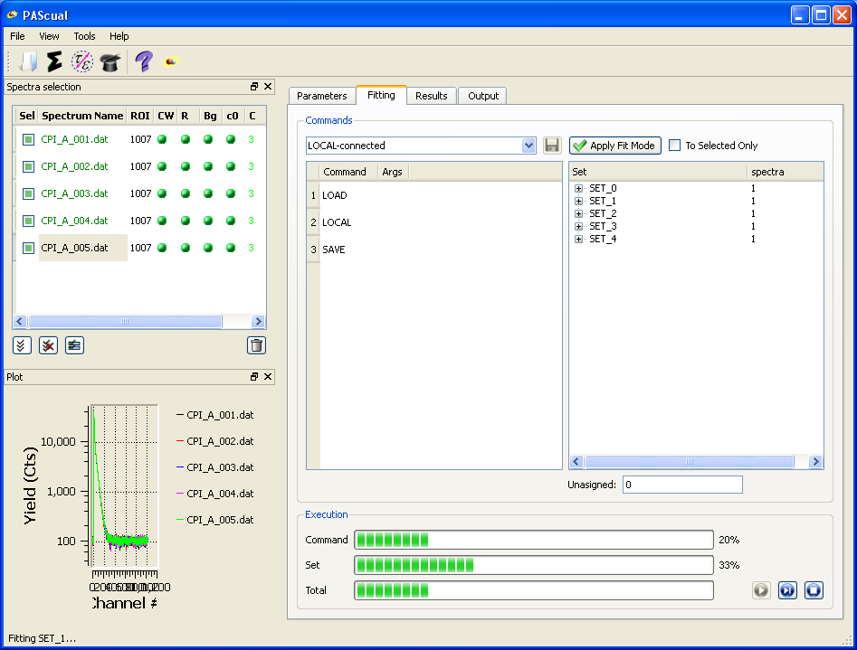
15.- The results for the fit of each set appear in the results table as soon as they are available, in the form of a compact table. More detailed information appears in the Output tab. Both the results table and the Output, can be saved to text files for future reference. Selections of results in the results table can also be copied: select with the mouse, right-click and choose "Copy Results (Selection)". This can be pasted into a spreadsheet program.

## Example 2: Fitting a series of related spectra.

(To be written)

## Example 3: Use of common parameters.

(To be written)

# Mathematical background

The mathematical background of PAScual has been written in the following paper:

1.  C. Pascual-Izarra et al., “Characterisation of Amphiphile Self-Assembly Materials using Positron Annihilation Lifetime Spectroscopy (PALS)-Part1: Advanced Fitting Algorithms for Data Analysis,” _Journal of Physical Chemistry B_, vol. in review, 2008.

# Text mode user interface (advanced)

## Quick answer

To use PAScual in text mode (advanced, you need some familiarity with Python syntax):

1.  Edit <tt>PAScual_Input.py</tt> to your needs (better if you do it with the IDLE editor included in the Python distribution). If you have used Melt, you may find some options and structure familiar.
2.  Either run <tt>PAScual_Input.py</tt> (you can do it from IDLE while editing it) or run <tt>PAScual.py</tt>.

## Long answer

(To be written)

# Citing PAScual

If you use PAScual for your research, please acknowledge it by citing the following paper:

C. Pascual-Izarra et al., _Characterisation of Amphiphile Self-Assembly Materials using Positron Annihilation Lifetime Spectroscopy (PALS)-Part1: Advanced Fitting Algorithms for Data Analysis_, Journal of Physical Chemistry B, [in review], 2008.

see [http://pascual.sourceforge.net](http://pascual.sourceforge.net) for up-to-date information about citing.

Also, if you modify PAScual or use its source code for your own program, please notify me so that maybe your code can be included in future versions of PAScual and be useful for other people.

In any case, if you distribute any code derived from PAScual, make sure to do so according to [PAScual's licensing terms](License.html).

# Glosary

This is a list of definitions for terms used in this manual.

*   Common parameter. A parameter whose value is is free for fitting but which is common to two or more spectra.
*   Fitting Mode. A sequence of commands to be executed for each set of spectra.
*   Fixed parameter. A parameter whose value is not to be varied during the fit.
*   Free parameter. A parameter whose value will be varied during the fit.
*   ROI (Region Of Interest). This is the part of the spectrum that will be considered for fitting purposes
*   Spectra Set. Group of spectra that share at list one common fitting parameter. All the spectra of one set are fitted simultaneously in a single fit that minimises the total chi-squared value.

